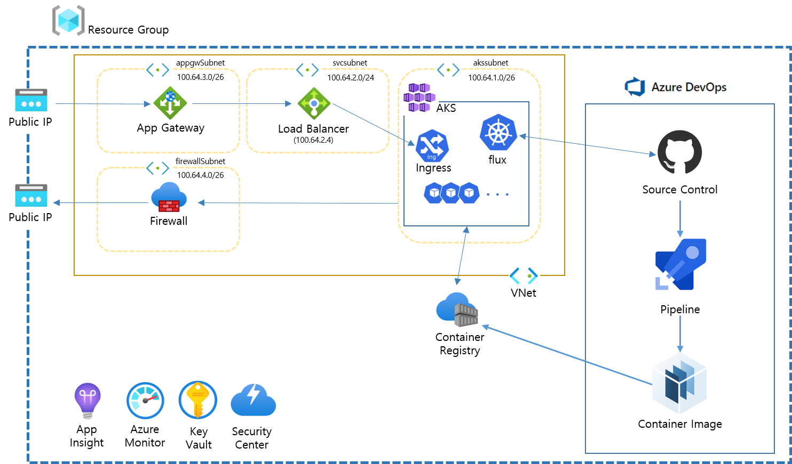

## 1. 구성도


## 1. 변수
### 동일 폴더 내에 terraform.tfvars 파일 생성

```bash

location = "koreacentral" 
prefix = " " #고유한 이름 삽입(소문자만 가능, 특수문자 불가)

# --- VNet 및 Subnet 주소 설정 ---
vnetAddress = "100.64.0.0/16"
aksSubnetAddress = "100.64.128.0/20"
svcSubnetAddress = "100.64.2.0/24"
appgwSubnetAddress = "100.64.3.0/24"
fwSubnetAddress = "100.64.4.0/24"
  
svcLoadbalancerAddress = "100.64.2.4" #로드밸런서 아이피 지정(svcSubnetAddress 대역의 .4 번 지정)
kubernetes_version = "1.19.3" #쿠버네티스 버전 지정
admin_username = "azureuser" #nodepool의 linux user name

# --- github 레포지토리 및 토큰정보 설정 ---
github_repository = "aksonazure"
github_organization = "daintree-henry"
github_token = "53a51517b2ddc1f90c285ef48339a05e2919d141"
```


## 2. 리소스 그룹 생성

[main.tf](https://github.com/daintree-henry/aksonazure/blob/main/terraform/dev/main.tf)

```bash
resource "azurerm_resource_group" "rg"
```

## 3. VNet 생성

[main.tf](https://github.com/daintree-henry/aksonazure/blob/main/terraform/dev/main.tf)

```bash
# --- vnet 및 subnet 생성 ---
resource "azurerm_virtual_network" "vnet"  
resource "azurerm_subnet" "akssubnet"  
resource "azurerm_subnet" "svcsubnet"  
resource "azurerm_subnet" "appgwsubnet"  
resource "azurerm_subnet" "fwsubnet"

# --- firewall, applicaion gateway의 public ip 설정 ---  
resource "azurerm_public_ip" "fwpublicip"  
resource "azurerm_public_ip" "agpublicip" 
```

## 4. Firewall 생성

[main.tf](https://github.com/daintree-henry/aksonazure/blob/main/terraform/dev/main.tf)
```bash
# --- firewall 및 route table 생성, subnet 연동 ---  
resource "azurerm_firewall" "fw" 
resource "azurerm_route_table" "fwrt"  
resource "azurerm_subnet_route_table_association" "srta" 

# --- firewall rule 설정 (L4, L7) ---  
# https://docs.microsoft.com/ko-kr/azure/aks/limit-egress-traffic
resource "azurerm_firewall_network_rule_collection" "aksfwnr1"  
resource "azurerm_firewall_network_rule_collection" "aksfwnr2"  
resource "azurerm_firewall_network_rule_collection" "aksfwnr3"  
resource "azurerm_firewall_network_rule_collection" "aksfwnr4"  
resource "azurerm_firewall_application_rule_collection" "aksfwar"  
resource "azurerm_firewall_application_rule_collection" "AKS"
```

## 5. Application Gateway 생성
[main.tf](https://github.com/daintree-henry/aksonazure/blob/main/terraform/dev/main.tf)
```bash
resource "azurerm_application_gateway" "network"  
```

## 6. 스토리지 어카운트, 이미지 레지스트리 생성 
[main.tf](https://github.com/daintree-henry/aksonazure/blob/main/terraform/dev/main.tf)
```bash
resource "azurerm_storage_account" "storage" 
resource "azurerm_container_registry" "acr"  
```

## 7. AKS 생성
[main.tf](https://github.com/daintree-henry/aksonazure/blob/main/terraform/dev/main.tf)
```bash
resource "azurerm_kubernetes_cluster" "main" 
resource "azurerm_role_assignment" "role1" 
resource "azurerm_role_assignment" "role2"  
```

## 8. flux 설치
[flux.tf](https://github.com/daintree-henry/aksonazure/blob/main/terraform/dev/flux.tf)

flux는 일정 간격을 통해 github의 yaml파일을 읽어와 kuberenetes에 동기화합니다.
flux.tf 파일은 helm이 아닌 kuberentes 모듈을 사용하여 직접 리소스를 배포합니다.

```bash
resource "kubernetes_namespace" "flux"  
resource "kubernetes_service_account" "flux"  
resource "kubernetes_cluster_role" "flux"  
resource "kubernetes_cluster_role_binding" "flux" 
resource "kubernetes_deployment" "flux"  
resource "kubernetes_secret" "flux-git-deploy"  
resource "kubernetes_deployment" "memcached"  
resource "kubernetes_service" "memcached"  
```

## 9.ingress helm 구성

[helm.tf]: https://github.com/daintree-henry/aksonazure/blob/main/terraform/dev/helm.tf

```bash
resource "kubernetes_namespace" "ingress"
resource "helm_release" "nginx_ingress"
```

## 10.테라폼 실행 명령
```bash
terraform init
 #테라폼 필요 모듈 설치 (provider.tf 파일 참고)

terraform plan
 #테라폼 실행 테스트 및 결과 출력

terraform apply
 #테라폼 실행 (실행 후 인프라 상태를 terraform.tfstate에 저장합니다.)

terraform state list
 #terraform.tfstate 파일에 저장된 상태를 참고하여 리스트 형태로 출력

terraform state rm {state명}
 #terraform.tfstate 파일에 저장된 상태를 하나 삭제
 #-> 테라폼 인프라 생성 후 리소스를 임의로 삭제했을 때 동기화를 위해 사용합니다.
```